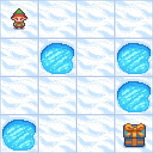
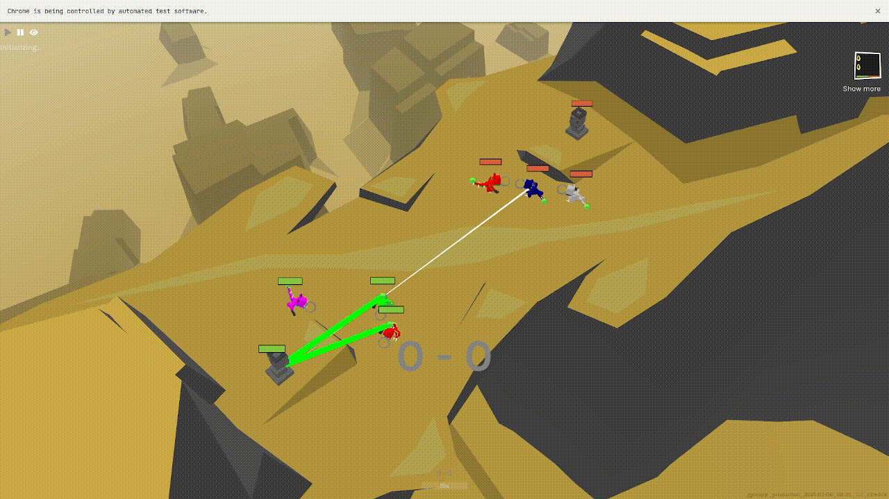

# A Comparison between NEAT and Behavior Trees on OpenAI Gym Environments

| Frozen Lake                                       | Lunar lander                                                             | Derk                                              |
| ------------------------------------------------- | ------------------------------------------------------------------------ | ------------------------------------------------- |
|  |  |  |

## How to install

Dependencies are collected in `requirements.txt` and can be installed with `pip`:

```bash
python -m venv .venv
source .venv/bin/activate
pip install -r requirements.txt
```

## How to run

### Neat

Frozen Lake:

```bash
# train
python neat_solver/run.py -e frozenlake -c configs/frozenlake/neat_train.toml

# inference
python neat_solver/run.py -e frozenlake -c configs/frozenlake/neat_inference.toml -i
```

Lunar Lander:

```bash
# train
python neat_solver/run.py -e lunarlander -c configs/lunarlander/neat_train.toml

# inference
python neat_solver/run.py -e lunarlander -c configs/lunarlander/neat_inference.toml -i
```

Derk:

```bash
# train
python neat_solver/run.py -e derk -c configs/derk/64input_12output.toml

# inference
python neat_solver/run.py -e derk -c configs/derk/64input_12output.toml -i
```

### Behavior Trees

Frozen Lake:

```bash
# train
python behavior_trees/lake_bt_run.py -c configs/frozenlake/bt.toml

# inference
python behavior_trees/lake_bt_run.py -c configs/frozenlake/bt.toml -i
```

Lunar Lander:

```bash
# train
python behavior_trees/lander_bt_run.py -c configs/lunarlander/bt.toml

# inference
python behavior_trees/lander_bt_run.py -c configs/lunarlander/bt.toml -i
```

Derk:

```bash
# train
python behavior_trees/derk_bt_run.py -c configs/derk/bt.toml

# inference
TODO
```

## Environments

### Frozen Lake

Frozen Lake is a grid-world game that simulates an agent navigating through a frozen lake. The game is played on a grid of square tiles, where the agent starts at the top left cell and it must navigate through the frozen lake to reach the goal which is located on the other side of the map. At every step, the agent receives as input an absolute number that represents its position on the grid, and it can move in one direction. The agent’s goal is to reach the final tile without falling into any of the holes scattered around the environment; a positive reward (one) is provided only when the goal is reached before the time limit, otherwise the reward is zero. By default, the map has a fixed size of 4x4, but it can be also customized with further parameters tweaking. There is also the possibility to make the map slippery, therefore making the agent’s moves non-deterministic.

### Lunar Lander

Lunar Lander is a Gym environment that consists of a trajectory optimization problem in which a rocket has to land smoothly on a specific target pad area on the lunar surface. The observation space includes lander position, velocity, angle, angular velocity, and whether or not each leg is touching the ground. There are three engines, two on the sides and one on the bottom of the rocket. Each engine can be activated individually to change the trajectory and velocity of the missile itself. Therefore the discrete action space is composed of the three engine fires and the do-nothing operation. The reward function favors a lander that is moving slowly, near the landing pad, horizontally positioned, that can land safely on the ground while saving as much propellant as possible. By its creators, agents that score more than 200 points are considered successful.

### Derk

Derk Gym is a MOBA-style Reinforcement Learning (RL) environment shipped as an OpenAI Gym environment. The game has two teams in competition, and each of them is composed of three agents. The agent’s goal is to defeat the enemy team and destroy the enemy tower by using up to three abilities that can consist of either offensive or defensive tools. The environment is fully observable and there are a total of 64 pieces of information sensed from the environment. An agent can decide to move, rotate, focus, chase, and activate an ability. The reward function can be customized and it is computed based on players’ interactions, for example encouraging damage to enemies and penalizing friendly fire. Derk Gym represents a challenging environment for many reasons, especially because some actions do not trigger an in- stant reward while others returns zero feedback. Moreover, the interaction between agents is built on top of many variables, such as weapons and abilities.

#### Game base rules

The game is played in "episodes" or "epochs", for each episode the agents are fixed, but if they "learn" through RL or other mechanisms, they can improve from the environment.
Each episode is split in steps, where each step is a "tick". An agent has a fixed set of actions, and the environment is updated accordingly when the agents perform one action among all possible ones. This is repeated for each tick of an episode.

After each episode ends, agents and environment are cleared.

#### Default configuration

Two teams composed by three agents and one totem. Each agent is generated with random equipment (arms, misc, tail). Each slot may be filled or not, giving each agent different "abilities". Our network should be able to correctly exploit any of these abilities and come up with a "good" strategy to destroy the enemy and win.

Win is defined by whichever team has the most points when time is up. Standard reward function promotes killing and destroying totems. All other actions have 0 reward.

Colors and aesthetics are present but randomly initialized and are not meaningful for the outcome. However, they are useful to distinguish the agents.

#### IO of an agent

The main goal of an agent is to take an action that maximizes his reward given the current environment.

##### Input

A tuple of four elements:

1. a numpy array of shape `(n_agents_per_team, n_observation)`: this represents observations made by all agents of one team. Given the fact that this is part of the input for the decision mechanism it seems that agents of the same team can share all information (all possible observation can be found [here](http://docs.gym.derkgame.com/#gym_derk.ObservationKeys)).
2. a numpy array of shape `(n_agents_per_team)`: this represents rewards associated to each team member of the same team. This is the fitness function computed by the library and the value can be negative, for this reason a NN with ReLU could cut some information.
3. a python list of one boolean element indicating done (maybe it represents the state of the game: running or done).
4. a list of dict or a dict representing information, it seems always empty.

##### Output

An array where each cell is the decision taken by an agent of a team. The decision is composed like a tuple of five elements:

1. a numpy array of one element: movement on X axis with range [-1, 1]
2. a numpy array of one element: rotation with range [-1, 1]
3. a numpy array of one element: chase focus with range [-1, 1]. If this is 1, the MoveX and Rotate actions are ignored and instead the Derkling runs towards its current focus. Numbers between 0-1 interpolates between this behavior and the MoveX/Rotate actions, and 0 means only MoveX and Rotate are used.
4. an integer: cast type, if
   - 0: don't cast
   - 1: cast ability 1
   - 2: cast ability 2
   - 3: cast ability 3
5. an integer: change focus, if (we need to understand why there are two integers for focusing other entities and if there is difference between the two values)
   - 0: keep current focus
   - 1: focus home statue
   - 2-3: focus teammates
   - 4: focus enemy statue
   - 5-7: focus enemy

#### Config parser

To improve reproducibility and readability of the code a `toml` config parser is used in the project. A toml file contains:

- the required information for the initialization of the game;
- the type of players that should be used;
- the required information for the initialization of each player;

##### Required sections

###### game

In game section there are four variables:

- fast_mode: enable or disable the fast mode;
- number_of_arenas: define the number of concurrent runs;
- train: enable or disable train mode;
- episodes_number: number of episodes;
- neat_config: path to the configuration for neat;
- weights_path: path where weights of the network will be saved.

###### reward-function

Section for the reward function

```toml
damageEnemyStatue = 4
damageEnemyUnit = 2
killEnemyStatue = 4
killEnemyUnit = 2
healFriendlyStatue = 1
healTeammate1 = 2
healTeammate2 = 2
timeSpentHomeBase = 0
timeSpentHomeTerritory = 0
timeSpentAwayTerritory = 0
timeSpentAwayBase = 0
damageTaken = -1
friendlyFire = -1
healEnemy = -1
fallDamageTaken = -10
statueDamageTaken = 0
manualBonus = 0
victory = 100
loss = -100
tie = 0
teamSpirit = 0.5
timeScaling = 0.8
```

##### Network input

Section for the network input

```toml
Hitpoints = true
Ability0Ready = true
FriendStatueDistance = true
FriendStatueAngle = true
Friend1Distance = true
Friend1Angle = true
Friend2Distance = true
Friend2Angle = true
EnemyStatueDistance = true
EnemyStatueAngle = true
Enemy1Distance = true
Enemy1Angle = true
Enemy2Distance = true
Enemy2Angle = true
Enemy3Distance = true
Enemy3Angle = true
HasFocus = true
FocusRelativeRotation = true
FocusFacingUs = true
FocusFocusingBack = true
FocusHitpoints = true
Ability1Ready = true
Ability2Ready = true
FocusDazed = true
FocusCrippled = true
HeightFront1 = true
HeightFront5 = true
HeightBack2 = true
PositionLeftRight = true
PositionUpDown = true
Stuck = true
UnusedSense31 = true
HasTalons = true
HasBloodClaws = true
HasCleavers = true
HasCripplers = true
HasHealingGland = true
HasVampireGland = true
HasFrogLegs = true
HasPistol = true
HasMagnum = true
HasBlaster = true
HasParalyzingDart = true
HasIronBubblegum = true
HasHeliumBubblegum = true
HasShell = true
HasTrombone = true
FocusHasTalons = true
FocusHasBloodClaws = true
FocusHasCleavers = true
FocusHasCripplers = true
FocusHasHealingGland = true
FocusHasVampireGland = true
FocusHasFrogLegs = true
FocusHasPistol = true
FocusHasMagnum = true
FocusHasBlaster = true
FocusHasParalyzingDart = true
FocusHasIronBubblegum = true
FocusHasHeliumBubblegum = true
FocusHasShell = true
FocusHasTrombone = true
UnusedExtraSense30 = true
UnusedExtraSense31 = true
```

###### players array

Each player is defined as:

```toml
[[players]]
path = 'path'
name = 'name'
args1 = 1
args2 = 3
```

Required files are:

- path: the namefile in which the class is contained, an example is [bot](derk_gym/agent/bot.py);
- name: the name class in the file indicated by path, an example is [DerkPlayer](derk_gym/agent/bot.py);
- all other fields in this section are field passed to the init method of the class.

During train phase it is required to have same player for both teams, instead for test phase it is possible to use different players.

####### Nueral Network NEAT

Configuration for neural network neat can be found [here](configs/derk/default_nn_neat.toml) and [here](configs/derk/default_nn_neat.ini).

####### Revisited Deep Q Learning with NEAT

Configuration for revisited deep q learning with neat can be found [here](configs/derk/q_learning_neat.toml) and [here](configs/derk/q_learning_neat_config.ini).

In order to avoid a mess of config files inside the repo all files ending with `.toml` are not pushed to the repo expect for the once contained inside `configs` directory (do not abuse of this power!!).
